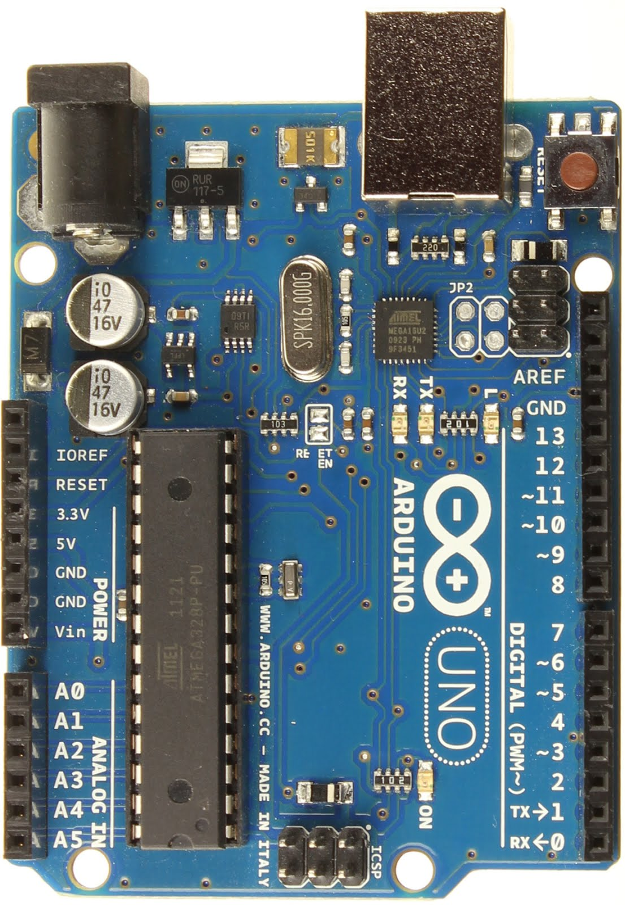
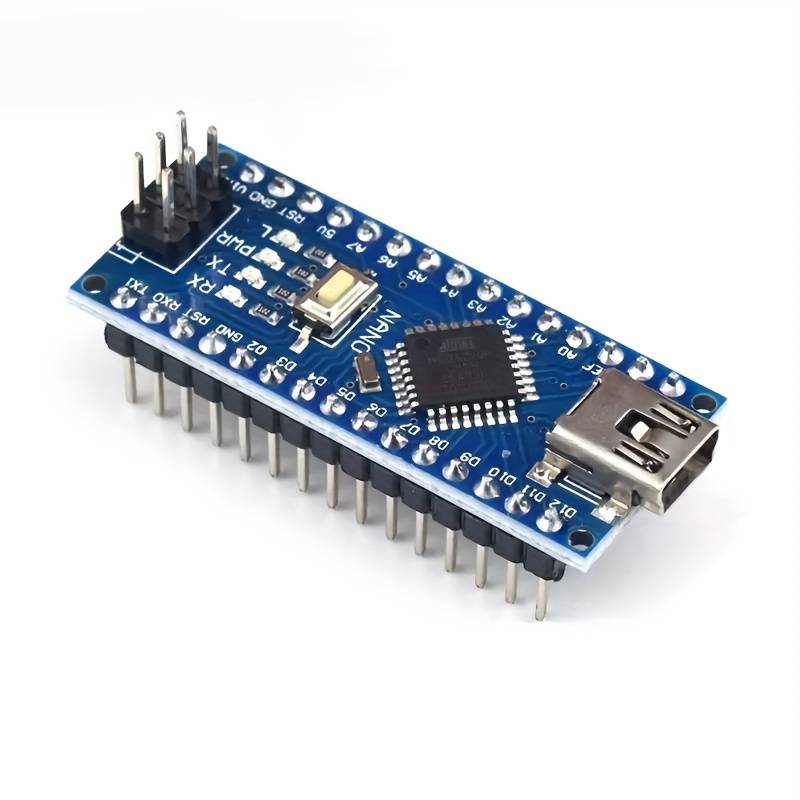
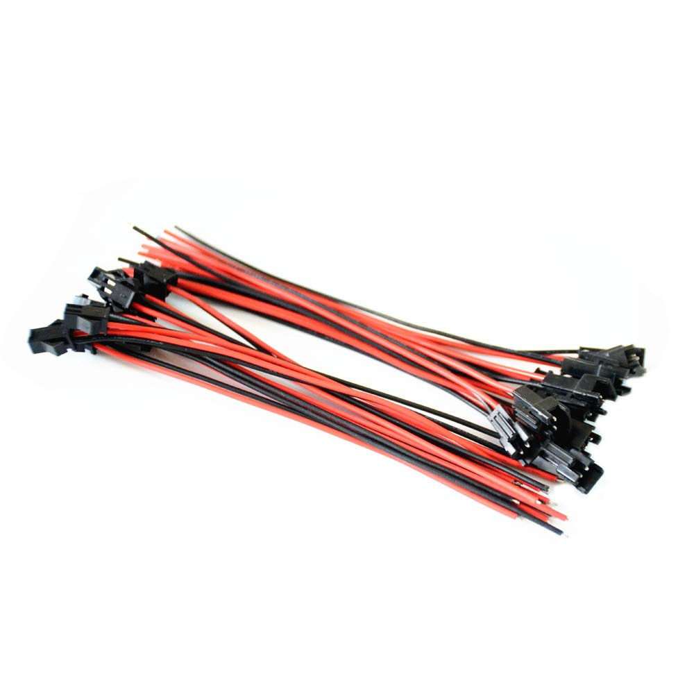
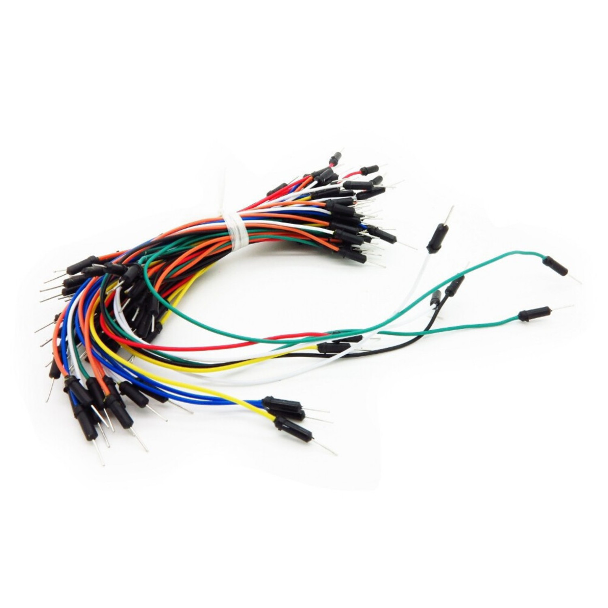
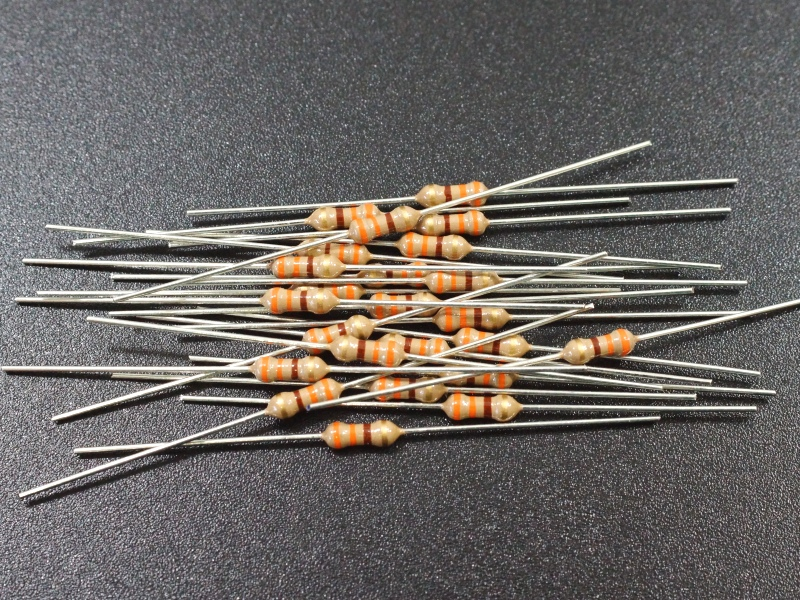
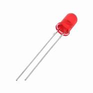

<!-- <body style = "background-color: black;">  -->
# Arduino nano to Arduino uno Serial communication

## Materials needed

<break> <break/>

### 1. Arduino uno (What will be recieving input i recomend getting  a full kit because it comes with all other componets needed and tons of other projects can be made with it)
<!-- <div> -->


[Starter kit link](https://amzn.to/3vyqykv)
<break> <break/>


<break> <break/>

### 2. Arduino nano(What will be sending data)

[Arduino nano](https://amzn.to/3vAcaIA)

<break> <break/>


<break> <break/>

### 3. 2 male to female wire connectors(Included in kit)

<break> <break/>


<break><break/>

### 4. 3 jumper wires (Included in kit) 

<break><break/>



<break> <break/>


### 5. 1 330 Ohm resistor(Included in kit)


<break><break/>

### 6. 1 L.E.D


## Project overview

> #### This project connects two microcontroller devices and allows them to transmit and receive data between eachother using UART(Universal Asynchronous Receiver-Transmitter) Serial communication. Serial communication is a method of data transmission where data is sent one bit at a time sequentially.

>> ##### Some examples of serial communication would be peripheral devices for instance (A Monitor, Mouse, keyboard, printers)

> #### To set up Serial Communication you must have the rx(receiver) pin of one device connected to the tx(transmitter) pin of another. 

## Pin out 
| Device | Pin | Connection |
| ---: | ---: | :--- |
| Arduino uno |8| L.E.D |
| Arduino nano |tx| Arduino uno rx|
| Arduino nano | G.N.D | Arduino uno G.N.D|


## Code

#### Arduino nano
```
// creates variable with type of char to receive serial input(What will be sent to the arduino uno)

char input;

// fuction that delays loop unless there is something in the serial buffer

void waitForInput(){
  while (Serial.available() == 0) {};
}


void setup() {
  // put your setup code here, to run once:
// starts serial monitor on 9600 baud rate or 9600 bits per second
Serial.begin(9600);
}

void loop() {
  // put your main code here, to run repeatedly:
// calls wait for input function
waitForInput();
// Reads serial buffer/what user types in
input = Serial.read();
// prints what user types in the serial monitor to be read by arduino uno
Serial.print(input);
}
```

#### Arduino uno

```
// pin which is connected to L.E.D
int lightPin = 8;
// String which stores value sent from arduino 
String lightValue;

void setup() {
  // put your setup code here, to run once:
// sets up serial monitor at 9600 baud rate (SAME AS ARDUINO NANO)
Serial.begin(9600);
// sets up led pin to output
pinMode(lightPin, OUTPUT);
}

void loop() {
  // put your main code here, to run repeatedly:
// Checks if serial buffer has data 
if(Serial.available() > 0){
// stores light value as a string received from serial buffer
lightValue = Serial.readString();
// prints value received to the serial buffer
Serial.println(lightValue);
// checks if the user typed "ON" if so sets the output to led to HIGH
if(lightValue == "ON"){
  Serial.println("Light On");
digitalWrite(lightPin,HIGH);
}
// checks if the user typed "OFF" if so sets the output to led to HIGH

if (lightValue == "OFF") {
Serial.println("Light Off");
digitalWrite(lightPin,LOW);
}
}
}

```


<!--  -->

<!-- 
things to include 


project over view 

project descrtiption 

project tutorial 
wiring 
diargham 
code 


where to go from here


materials needed
1.) Arduino uno(What will be recieving input i recomend getting full kit because it comes with all other componets needed and tons of other projects can be made with it) https://amzn.to/3vyqykv

2.) Arduino nano(What will be Sending input)https://amzn.to/3vAcaIA

3.) One male to female wire connector 

4.) one 330 Ohm resistor 

5.) Two jumper wires(1 red, 2 black)

6.) One led 

Serial communication explaiend 


wire diagrham 
with explnation


code explained


Where to go from here 
 -->